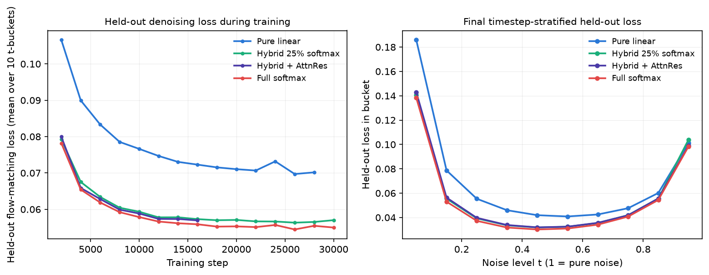
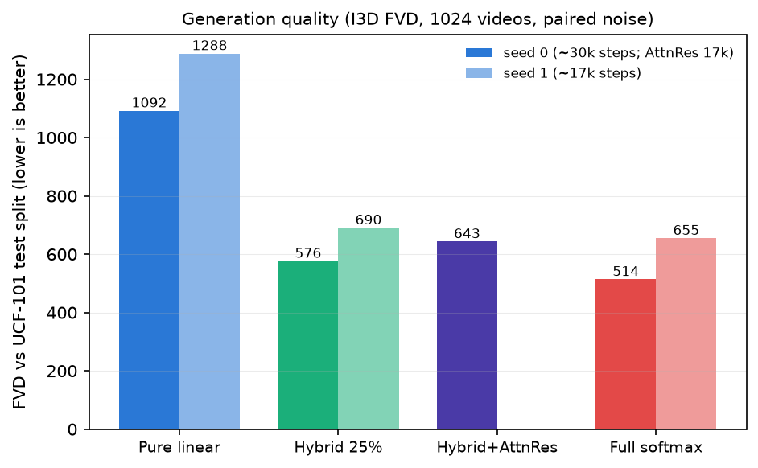
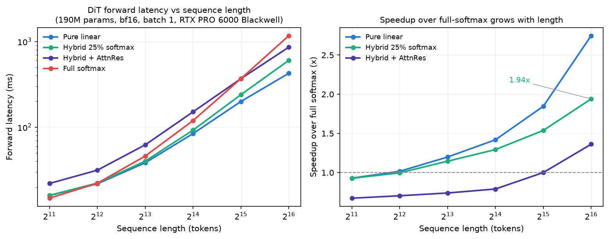
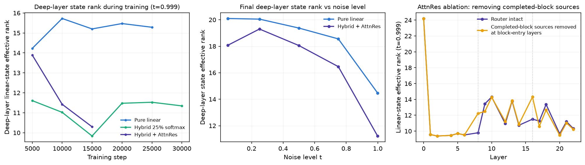
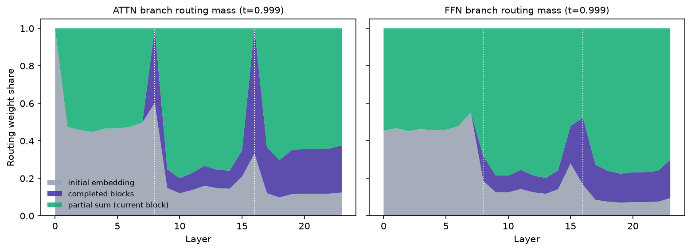

# Reproducing SANA-Video 2.0's hybrid-attention claims at reduced scale

**Verdict: partially reproduced.** At 190M-parameter scale on public UCF-101 video, the paper's central efficiency–expressiveness claim holds clearly and is seed-robust: a 25%-softmax hybrid DiT recovers nearly all of full softmax attention's quality while scaling like linear attention on long sequences. The AttnRes mechanism reproduces qualitatively (routing reuse, matched-step rank increase) but with smaller ablation effects than reported, and it costs more compute in our unfused implementation.

**How to read this figure.** Four identical 190M-parameter video diffusion models — differing *only* in their attention layers — were trained from scratch on the same UCF-101 clips for the same wall-clock budget. Left: held-out denoising loss during training (lower is better). The pure-linear model (blue) plateaus well above the hybrid (green) and full-softmax (red) curves, which are nearly indistinguishable — replacing just 6 of 24 linear layers with softmax "anchors" recovers almost the entire quality gap. Right: the gap holds at every noise level of the diffusion process.

## The question

SANA-Video 2.0 ([arXiv 2607.21553](https://arxiv.org/abs/2607.21553), NVIDIA) generates video with a Diffusion Transformer whose attention is mostly O(N) *linear* attention; every 4th layer is a full *softmax* "anchor" (25%), and "Block Attention Residuals" (AttnRes) route representations from completed 8-layer blocks to later layers. The paper claims this recovers softmax-level quality at near-linear cost. Weights and the exact implementation are unreleased, so we reconstructed the disclosed architecture inside the released Sana repository and tested two claims at reduced scale:

1. **Hybrid quality + scaling:** a 25% softmax-anchor hybrid improves held-out denoising and generation quality over a matched pure-linear DiT, while keeping better long-sequence scaling than full softmax.
2. **AttnRes mechanics:** block-span-8 AttnRes raises deep-layer effective rank and reuses completed-block representations, without erasing the hybrid's latency advantage.

## Setup

| | Paper | This reproduction |
|---|---|---|
| Model | 5B / 14B latent DiT, text-conditioned | 190M pixel-space DiT (24 layers, width 768), class-conditioned |
| Data | proprietary curated video corpus | UCF-101 (official split 1), 16×64×64 clips → 2048 tokens |
| Training | multi-stage curriculum | single-stage flow matching, 5.8h × 4 GPUs per variant |
| Attention | gated linear (SANA-style) + gated softmax anchors 3:1, AttnRes S=8 | same schedule, reconstructed from the paper's description |

Four matched variants (identical parameters, data order, and evaluation noise seeds): **pure-linear**, **hybrid-25%**, **full-softmax**, **hybrid+AttnRes**. The whole quartet was then re-run at seed 1 with a shorter 3.25h budget. Implementation: `repro/model.py` on the experiment branches (linear attention follows Sana's `LiteLAReLURope` — ReLU kernel, RoPE after the kernel, fp32 state math; the AttnRes router mixes RMS-normalized sources {initial embedding, completed-block sums, running partial sum} with a shared per-sublayer-type query).

## Claim 1a — held-out denoising loss: reproduced

Final stratified held-out loss (10 noise buckets, 2048 clips, fixed noise):

| Variant | seed 0 (5.8h, ~30k steps) | seed 1 (3.25h, ~17k steps) |
|---|---|---|
| Pure linear | 0.0700 | 0.0717 |
| Hybrid 25% | 0.0570* | 0.0574 |
| Full softmax | **0.0549** | **0.0559** |
| Hybrid + AttnRes | 0.0569 (17k steps) | (run stalled; curve tracks seed 0) |

The hybrid cuts the pure-linear loss gap to softmax by ~86% at both seeds, echoing the paper's proxy-study finding that hybrids approach (and there, exceed) both extremes. The ordering is identical at *every* validation checkpoint from step 2000 onward, at both seeds. (*hybrid seed-0 value is its step-30000 validation; its final-eval phase was lost to an infra hang — see Limitations.)

## Claim 1b — generation quality (FVD): reproduced

Fréchet Video Distance with the standard StyleGAN-V I3D features (1024 generated videos, paired noise seeds, vs the 7562-clip test split): the hybrid closes **89–94%** of the linear→softmax FVD gap (seed 0: 1092→576 vs floor 514; seed 1: 1288→690 vs floor 655). Sample frames (top to bottom: pure-linear, hybrid, softmax) show the pure-linear model's characteristic blur and structure loss:

Absolute FVDs are high — these are small pixel-space models trained a few hours — so the *relative ordering* is the evidence, not the absolute values.

## Claim 1c — long-sequence scaling: reproduced

Forward latency (bf16, batch 1, single RTX PRO 6000 Blackwell) from 2k to 65k tokens: pure linear grows near-linearly (16→426 ms), full softmax shows the quadratic term (15→1170 ms), and the hybrid's speedup over softmax **grows with length** — 1.0× at 4k to **1.94× at 65k tokens** — the same trend the paper reports across resolutions (1.16× at 480p → 2.01× at 1080p). Hybrid+AttnRes stays 1.36× faster than full softmax at 65k despite our unfused router.

## Claim 2 — AttnRes mechanics: partially reproduced

  

- **Cross-depth reuse — reproduced.** In the deepest block, the trained router assigns only 12–14% of attention-branch routing mass to the initial embedding; 29–50% goes to completed-block summaries (rising as noise decreases) and the rest to the current block's partial sum. The paper reports 56% on completed blocks for deep attention layers; our reconstruction shows the same qualitative preference for refreshed, completed-block information.
- **Rank increase — reproduced at matched step, compressed later.** At step 5000, AttnRes raises deep-layer linear-state effective rank by **+20%** over the plain hybrid (13.9 vs 11.6 at maximum noise; paper: ~+12% in a same-checkpoint probe). Later in training both models' state ranks compress and the gap closes — a dynamic the paper does not report.
- **Block-entry ablation — same direction, smaller magnitude.** Removing completed-block sources at block-entry layers cuts the entry layer's state rank by **31%** at mid noise (16.6→11.5), localized to that layer as the paper describes — but far short of the reported 82–91% reduction. Our additive-router reconstruction likely differs from the paper's exact design here.
- **Quality/cost:** at matched *step*, AttnRes validation loss is at parity or slightly better than the hybrid (e.g., 0.0659 vs 0.0675 at step 4000). At matched *wall-clock* it is worse, because our eager-PyTorch router costs ~45% throughput (0.97 vs 1.76 steps/s) and +42% inference latency — a real overhead the paper's fused kernels are designed to amortize. We cannot confirm "without erasing the latency advantage" in the strong sense at our implementation quality; the weak sense (still much faster than full softmax at long sequences) holds.

## Limitations

- 26× fewer parameters than the paper's 5B model, public UCF-101 instead of a proprietary corpus, pixel space instead of a video VAE, class instead of text conditioning, single-stage training. The paper's quality *ordering* transfers to this regime; its absolute numbers cannot.
- One full-budget seed plus one shorter-budget seed; no confidence intervals beyond the two-seed agreement.
- Eager PyTorch throughout (no fused kernels, no torch.compile) — latency *constants* are not comparable to the paper's optimized stack, only scaling *shapes*.
- Two of nine training runs (hybrid seed-0's final-eval phase, AttnRes seed-1 at step ~8000) were lost to an NCCL hang around rank-0-only evaluation under torch 2.8.0a0; all metrics logged before each hang are intact and are what we report.
- The AttnRes router is a reconstruction from prose; magnitude mismatches on the ablation probe plausibly trace to design differences.

## Compute

All experiments ran on the operator's Kubernetes cluster via `orx exp run --backend k8s`: NVIDIA RTX PRO 6000 Blackwell GPUs, **peak 16 concurrent GPUs** (2 nodes × 8), ~11.7 hours total elapsed wall time (02:35–14:17 UTC, 2026-07-25). Nine training runs (4 variants × 2 seeds + 1 restart), one 4-way latency benchmark, and one checkpoint-based FVD evaluation; ~135 GPU-hours of successful runs.

## Pointers

- Reproduction code: `repro/` on the experiment branches (e.g. [`orx/baseline-pure-linear-video-dit-ucf-101-16x64x64`](https://github.com/alphaXiv/sana-d11564ce/tree/orx/baseline-pure-linear-video-dit-ucf-101-16x64x64)); per-branch `repro/config.py` selects the variant.
- Interactive walkthrough with all result data embedded: [`notebooks/sana_video2_repro.py`](../../notebooks/sana_video2_repro.py) (marimo).
- Full experiment log: README table at the repository root.
